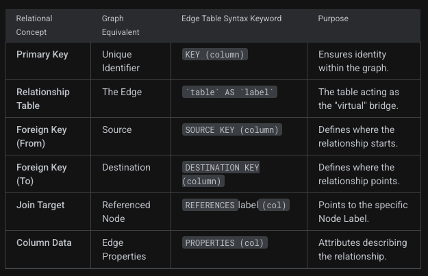

# Engineering Guide: Introduction to BigQuery Graph (SQL/PGQ)

This guide provides a technical overview of BigQuery Graph for data engineers. It focuses on how to map traditional relational Iceberg/BigQuery tables into a logical property graph using the Marketing Performance dataset as a reference.

---

## 1. Core Architectural Principles

*   **Logical Abstraction:** BigQuery Graph is a metadata layer. It defines a "Property Graph" without duplicating or moving the underlying physical data.
*   **The "Virtual Join":** By defining edges in DDL, you standardize relationship logic. This removes the need for complex, repetitive JOIN syntax in analytical queries.
*   **Performance:** BigQuery uses the `KEY` definitions to optimize traversal, often outperforming standard ad-hoc relational joins for multi-hop path analysis.

---
## 2. Syntax

Imagine a simplified graph linking **Campaigns** (The Parent) to **Creatives** (The Child) in a 1:Many relationship.

Every node must have a unique key. Note that we use `AS` to provide a clean label for querying.

```sql
CREATE OR REPLACE PROPERTY GRAPH `wpp-dataproducts-lakehouse.marketing.marketing_performance_graph`
NODE TABLES (
  `wpp-dataproducts-lakehouse.marketing.campaigns` AS `campaigns`
    KEY (`campaign_id`)
    LABEL `campaigns` 
    PROPERTIES (campaign_id, campaign_name, budget_usd),

  `wpp-dataproducts-lakehouse.marketing.creatives` AS `creatives`
    KEY (`creative_id`)
    LABEL `creatives`
    PROPERTIES (creative_id, creative_name, format)
)
```

### a. The Logical Container (`CREATE PROPERTY GRAPH`)
The `CREATE OR REPLACE PROPERTY GRAPH` statement establishes a metadata layer. It functions as a schema that maps existing relational tables to graph structures without moving or duplicating the underlying data.

### b. Node Tables: Defining the "Nouns"
The `NODE TABLES` section identifies the entities in your graph (e.g., Audience, Campaigns, Cookies).
*   **KEY:** A unique identifier required for BigQuery to maintain identity across the graph.
*   **LABEL:** A tag used for querying (e.g., labeling `marketing.audience` as `audience` to allow `MATCH (a:audience)`).
*   **PROPERTIES:** Maps table columns to graph attributes, allowing for user-friendly renaming via `AS`.

### c. Edge Tables: Defining the "Verbs"
The `EDGE TABLES` section defines the relationships between nodes. 
*   **SOURCE/DESTINATION KEY:** Specifies where the relationship begins and ends.
*   **REFERENCES:** Identifies the specific `NODE TABLE` (by label) that the edge connects.

### d. Graph Patterns vs. Relational Joins
While standard SQL relies on `JOIN` and `ON` clauses at execution time, Graph syntax defines relationships upfront in the DDL. This enables "Path Patterns" (e.g., `MATCH (c)-[e]->(cr)`), making complex multi-hop analysis significantly more readable and maintainable than nested joins.

---

## 3. Concept Mapping: Relational vs. Graph

Use this table to translate traditional SQL schema designs into the `CREATE PROPERTY GRAPH` syntax.



---


